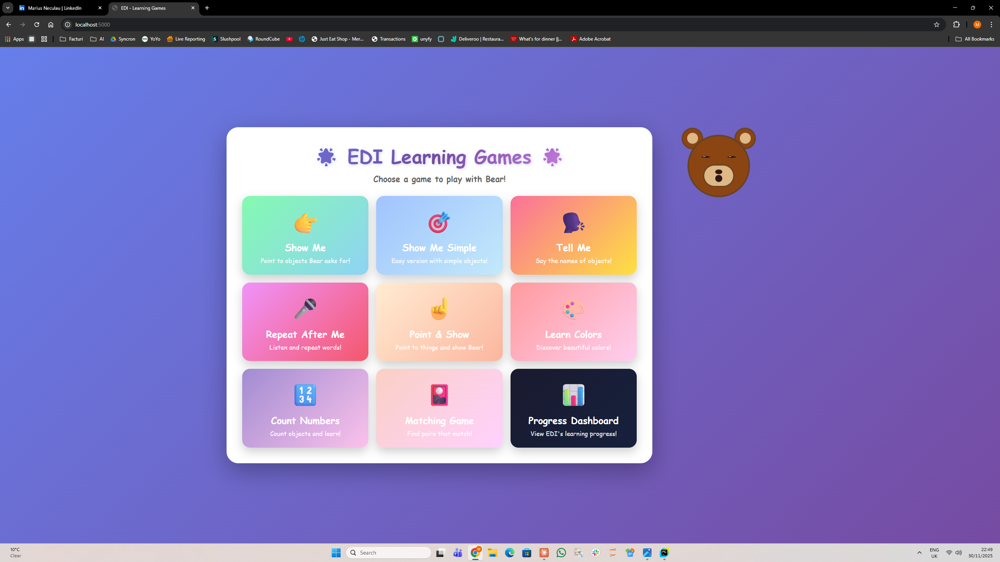

# 🐻 EDI AI - Local AI System for ABA Therapy

A desktop application for ABA (Applied Behavior Analysis) therapy exercises with an animated bear avatar assistant.

[](https://www.python.org/downloads/)
[](https://flask.palletsprojects.com/)
[](https://opensource.org/licenses/MIT)

---

## ✨ Features

- **Privacy-First Architecture** - Runs 100% locally, no cloud dependencies. GDPR compliant for sensitive medical data.
- **Animated Avatar (Aidy)** - Friendly bear character with CSS animations that guides children through exercises.
- **Voice Synthesis** - Text-to-speech instructions in multiple languages using Web Speech API.
- **Pre-recorded Audio** - High-quality MP3 files for consistent audio experience.
- **Progress Tracking** - Built-in tracker to monitor child's performance across sessions.
- **Multiple Exercise Types** - Comprehensive ABA therapy coverage (see below).

---

## 📚 Included Exercises

| Exercise | Description | Skill Target |
|----------|-------------|--------------|
| **Give Me (Receptive)** | Child identifies and gives requested object | Object recognition |
| **Tell Me (Expressive)** | Child names displayed objects | Vocabulary building |
| **Learn Colors** | Color identification and matching | Color recognition |
| **Count Numbers** | Counting and number recognition | Numeracy skills |
| **Matching** | Pairing similar objects | Visual discrimination |
| **Pointing** | Point to requested items | Following instructions |
| **Repeat After Me** | Repeat words/sounds | Speech development |
| **Clap Your Hands** | Microphone-based clap detection | Motor skills & listening |

---

## 🖥️ Screenshot



*The friendly bear avatar "Aidy" guiding a child through an exercise*

---

## 🚀 Quick Start

### 1. Clone the repository
```bash
git clone https://github.com/MariusNeculau/EDI_AI.git
cd EDI_AI
```

### 2. Install dependencies
```bash
pip install -r requirements.txt
```

### 3. Run the server
```bash
python eduard_web_server.py
```

### 4. Open in browser
```
http://localhost:5000
```

---

## 📁 Project Structure

```
EDI_AI/
├── README.md                    # Project documentation
├── LICENSE                      # MIT License
├── requirements.txt             # Python dependencies
│
├── eduard_web_server.py         # Flask server (main entry point)
├── eduard_interface.html        # Main menu interface
├── dashboard.html               # Progress dashboard
│
├── eduard_bear_avatar.html      # Animated bear component
├── eduard_receptive.html        # Give Me exercise
├── eduard_receptive_simple.html # Give Me (simplified)
├── eduard_expressive.html       # Tell Me exercise
├── eduard_colors.html           # Colors exercise
├── eduard_numbers.html          # Numbers exercise
├── eduard_matching.html         # Matching exercise
├── eduard_pointing.html         # Pointing exercise
├── eduard_repeat.html           # Repeat exercise
├── clap_exercise.html           # Clap detection exercise
│
├── audio/                       # Pre-recorded MP3 audio files
│   ├── welcome_*.mp3            # Welcome messages
│   ├── correct.mp3              # Positive feedback
│   ├── try_again.mp3            # Encouragement
│   └── ...                      # 80+ audio files
│
└── tracker.js                   # Progress tracking system
```

---

## 🛠️ Technical Stack

| Component | Technology |
|-----------|------------|
| **Backend** | Python Flask |
| **Frontend** | HTML5, CSS3, Vanilla JavaScript |
| **Audio** | Web Speech API + Pre-recorded MP3 |
| **Avatar** | Pure CSS animations |
| **LLM Integration** | Llama 3.2 via Ollama (optional) |

---

## ⚙️ Configuration

### Voice Settings
The avatar uses these default voice parameters:
- **Voice**: Female
- **Pitch**: 0.9
- **Rate**: 0.7

These can be adjusted in each exercise HTML file.

### Hardware Requirements
- **Minimum**: Any modern computer with a web browser
- **Recommended**: For LLM features - RTX 3060+ GPU, 16GB RAM
- **Optimized for**: RTX 5060 Ti 16GB (<50ms response latency)

---

## 🔒 Privacy & Compliance

This application was specifically designed with privacy in mind:

- ✅ **100% Offline** - No data leaves the local machine
- ✅ **No Cloud Dependencies** - Works without internet connection
- ✅ **GDPR Compliant** - Suitable for handling sensitive medical data
- ✅ **No Tracking** - No analytics or telemetry

---

## 📄 License

This project is licensed under the MIT License - see the [LICENSE](LICENSE) file for details.

---

## 👤 Author

**Marius Neculau**  
AI Engineer | Python Developer

- LinkedIn: [marius-neculau](https://linkedin.com/in/marius-neculau)
- GitHub: [MariusNeculau](https://github.com/MariusNeculau)

---

## 🙏 Acknowledgments

This project was developed as part of the AI Engineering certification at Software Development Academy. Special dedication to Eduard (Aidy) ❤️
